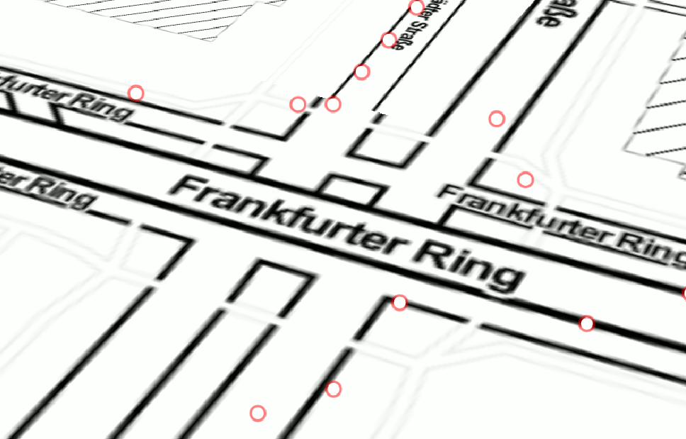

# What is the CZMLMovingObjects Plugin ?

CZMLMovingObjects plugin is a tool to create CZML files for moving objects in QGIS software more easily.

Moving objects could be any object that is represented in a GIS data layer as points and shares some keys to recognize objects (For Exp. vehicle_id).


A sample image shows the cars in an intersection

## How to install? 

1. Download the zip file from releases page.
2. Go to **Plugins > Manage and Install Plugins > Install From ZIP** in QGIS.
3. Select the ZIP file and click to **Install Plugin** button.

## Requirements

1. Input data must be a point layer.
2. Input data must be reprojected in EPSG:4326 (Geographic Coordinate System).
3. Input data must include Z values, if it doesn't you can add simply with **Set Z Value** tool in the **Processing Toolbox**.
	- This issue will be fixed after future releases.
4. Input data must include an epoch time (Date+Time value of the start of the whole movement).
	- This attribute must be in QDateTime data type (It is the default data type for Date+Time values in QGIS).
5. Input data must include time value in seconds unit.

## What for is used Configure Clock tab in the plugin?

**Configure Clock** plugin ususally used for single part CZML files. If you dont want to specify the duration of whole animation in Cesium Java Script code block, then you can use this option to specify the animation duration directly inside the CZML file. Cesium widget will listen the header of the CZML file and if the clock configurations specified, it will start the animation from given start time and end at the given date+time. 

## How to visualize?

For the CZML files, you have to find a proper way to add CZML files.

Most simple method is using giving relative path of CZML files like in the code below:
```javascript
<script>
//...
//OTHER CESIUMJS CODES
//...

// Adds CZML file into DataSources:
var dataSourcePromise = Cesium.CzmlDataSource.load("YOUR_RELATIVE_PATH_TO_THE_CZML_FILE"); 
// Adds Data Source with the CZML file into Viewer
viewer.dataSources.add(dataSourcePromise);
// Zoom to the extent of given CZML file:
viewer.zoomTo(dataSourcePromise);
</script>
```
For other complicated use cases, feel free to look into "test_files" folder.

Enjoy the tool!